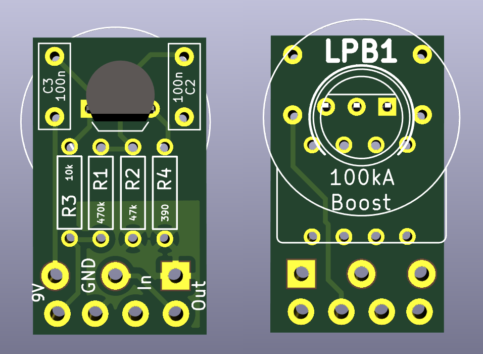

# LPB1

A tiny, inline-board approach to the classic EHX Linear Power Booster.

# Parts
## Resistors
| Part | Value | Notes |
|----|:---:|-----|
| R1 | 470k | |
| R2 | 47k | |
| R3 | 10k | |
| R4 | 390 | Replace with 1kC pot for gain control |

## Capacitors
| Part | Value | Notes |
|----|:---:|-----|
| C2 | 100n | Input filter cap |
| C3 | 100n | Output filter cap |

## Transistors
| Part | Value | Notes |
|----|:---:|-----|
| Q2 | 2n5088 | | 

## Potentiometers
| Part | Value | Notes |
|----|:---:|-----|
| RV2 | "LPBBoost 100kA" | |

| Part | Value | Notes |
|----|:---:|-----|
| J1 | 9V | There is no onboard power conditioning |
| J2 | GND | External reverse-polarity protection recommended |
| J3 | In | PCB In |
| J4 | Out | PCB Out |

# Notes
+ `R4` can be replaced with a variable resistor for control over gain
+ `C2` affects input filtering - increase for more bass, decrease for more treble
+ `C3` affects output filtering - same as above, but be mindful of 'muddiness' with too much bass
