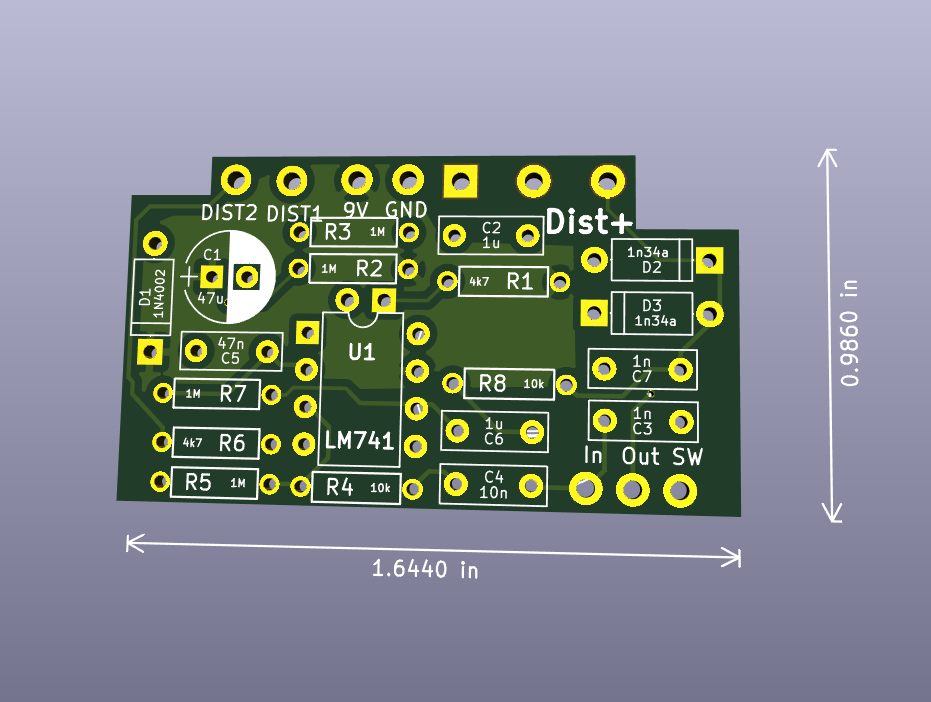
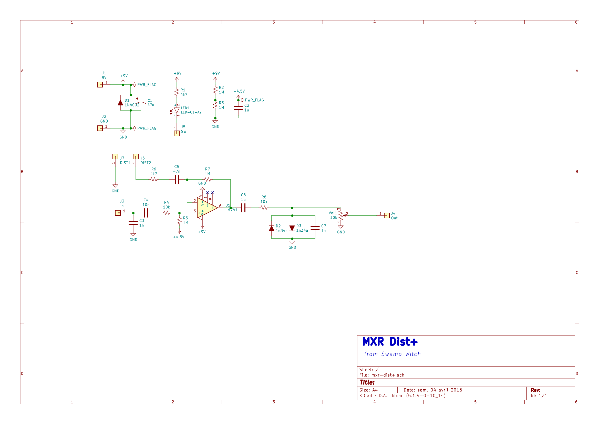

## Overview
The MXR Dist+ is a simple distortion circuit, taking advantage of an inverting op-amp to maximize gain. As the distortion potentiometer is turned up, the feedback resistance decreases and gain increases. Changing the resistance also changes the pole of the high-pass filter created at the inverting input.

See Modifications section for variations.

### Bill of Materials
| Resistor | Value |
|---|---|
| R1* | 4k7 |
| R2 | 1M |
| R3 | 1M |
| R4 | 10k |
| R5 | 1M |
| R6 | 4k7 |
| R7 | 1M |
| R8 | 10k |

*\** _*R1* is the Current limiting resistor for the LED._

| Capacitor | Value |
|---|---|
| C1 | 47u +/- |
| C2 | 1u |
| C3 | 1n |
| C4 | 10n |
| C5 | 47n |
| C6 | 1u |
| C7 | 1u |

| Diode | Value |
|---|---|
| D1 | 1N4002 |
| D2 | 1n34a |
| D3 | 1n34a |

| IC | Value |
|---|---|
| U1 | LM741 |

| Potentiometer | Value |
|---|---|
| Volume | 10kΩ B |
| Distortion* | 1MΩ B |

* Distortion potentiometer will need to be wired off-board. Connect lugs 1 and 2 together, and wire this connection to `DIST1`. Connect lug 3 to `DIST2`. 

### Modifications
1) Decrease the noise floor: excluding `D1`, `C1`, `C2`, and `R1-R3`, increasing all capacitor values by 10x and reducing all resistor values by 10x (e.g. 470nF --> 4u7 and 1MΩ --> 100kΩ)
2) Diode modifications: changing `D2`/`D3` will yield different pedal characteristics. Socket the diodes to test new variations. Imbalanced diodes (two diodes in series on one side) will also change the clipping-style.
3) Distortion input modification: changing what resistor/resistance `DIST1` and `DIST2` are connected to is possible. Any one of LFO/LDR pair, an envelope detector, or an expression pedal can be used outside of a basic potentiometer.

## Build Order
1) Resistors
    * Be sure to double check values! It can be easy to mistake a 10k for 1k, for example. 
    * You can change the brightness of your LED by changing the value of `R1` (e.g. 2kΩ for a super bright LED, 10kΩ for a dimmer one)
2) Capacitors
    * Ensure correct polarity of eletrolytic capacitors (C1). The long leg (anode) is the square pad (pin 1), and should match the print on the board.
3) Diodes
    *  Ensure correct polarity -- the diode-band should match the screened one on the board.
4) Socket the ICs
5) Potentiometers
    * Drill the enclosure and fit these first before installing into the PCB.
6) LED
    * Ensure correct polarity. The longer leg (anode) is the square pad (pin 1), and the flat side should match the print on the board. Especially when wiring the LED off-board, double-check your polarity. I use different colored wires, or markings, to help differentiate.
7) Jacks
    * Wire up the input, output and power jacks. I usually measure these wires with the components mounted in the enclosure. 
8) Switch
    * Wire up the 3PDT footswitch to the jacks and PCB. See [Sources](#sources) for resources on 3PDT wiring diagrams.
  
### Boxing
The PCB is fairly small, and should fit in most enclosures. The Distortion potentiometer (wired to `DIST1`/`DIST2`) will need to be wired in, as well as the LED (unless native position is preferred, which is unlikely). 

## Schematic
Swamp Witch Dist+ Schematic

## Sources
* [Electrosmash MXR Dist+ Analysis](https://www.electrosmash.com/mxr-distortion-plus-analysis)
* [Coda Effects 3PDT Footswitch Wiring](https://www.coda-effects.com/2015/03/3pdt-and-true-bypass-wiring.html)
* [MadBean Pedals 3PDT Footswitch Wiring](http://www.madbeanpedals.com/tutorials/downloads/MBP_FootswitchWiring.pdf)
