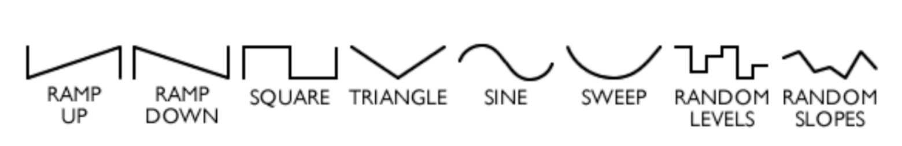

# Season of the Witch

The `Season of the Witch` is, at its core, a modulating digital delay pedal. The modulation can be accomplished via an LFO circuit, which uses the [StompLFO chip](https://electricdruid.net/datasheets/STOMPLFODatasheet.pdf) from [Electric Druid](https://electricdruid.net/product/stomplfo/), a TRS-capable expression pedal, or a 0-5V TS CV signal. The digital delay is driven by the [PT2399](https://www.electrosmash.com/pt2399-analysis), a common short-range delay chip. But the `Season of the Witch` is also so much more than a modulated delay: it is a space-time manipulator, a seasick harmony machine, an ambient movie soundtrack generator, and a shoegaze tone factory all in one. 

The pedal includes standard delay controls: dry/wet `Blend`, amount of `Feedback` in the signal, the `Delay` time,  and a transparent `Boost` to add a little more body and drive to the signal, as well as two internal trimmers. Turn down the`Chaos` trimmer control to reign in or let loose the `Feedback`. The `Delay` internal trimmer controls how far the delay chip will be pushed: if you want dying computer noises, turn this setting _down_. Be warned, however, if the control signal goes too low, the delay chip will shut off completely. It also includes controls for the Control Signal, which will be discussed in depth later: `Rate`, `Waveform` selection, and `Offset` and `Depth` controls for fine-tuned wave control (_"Control Signal"_ is any of the three types of available control: internal LFO, external TRS expression pedal, or 0-5V CV generator).

There are three switches on the Season of the Witch as well: one for changing the delay time with the Control Signal, one for changing the amount of feedback with the Control Signal, and finally a phase switch for the feedback modulation -- _in-phase, long delay times are paired with lots of feedback, and out-of-phase, short delay times are paired with lots of feedback_.

When your signal combines with the Control Signal, the results can be otherworldly. Subtle variation of the Control Siganl produces warm, wavering sounds, much like a chorus pedal. Less than subtle variation produces wild, pitch-shifting, potentially-arpeggiated noises: changing the variation from gentle to almost unrecognizable.

---

## Controls

## Pedal Controls	

### Boost
Controls the amount of gain provided to the output of the blended signal. The boost is a transparent MOSFET boost inspired by the [AMZ Booster](http://www.muzique.com/schem/mosfet.htm). Maximum gain is nearly 40 dB, so use this wisely!

### Blend
Controls the amount of delayed signal in the output. Completely on will be nothing but delayed signal, completely off will be nothing but clean signal.

### Delay
Controls the delay time. The pedal is capable of self-oscillation at higher settings (depending on the `Chaos` setting). The range of usable delay times is approximately 35ms to ~500ms. Longer delay times are possible, but signal degradation is guaranteed beyond this range. Of course, if you were looking for normal-signal delay pedal, you probably wouldn't be here! 

#### Delay Trimmer
Internally, there is a trimmer for how far the delay signal can be controlled. Turn this _up_ for lower amounts of change in the delay time, and _down_ for more swing. **NOTE: If your delay signal dies, start here!**

### Delay Modulation Switch
When flipped on, removes control of the delay time from the `Delay` pot and transfers control entirely to the `Control Signal`. When flipped off, the delay time is controlled entirely by the `Delay` pot.

### Feedback
Controls the amount of feedback (number of repeats) in the signal. The pedal is capable of self-oscillation at higher settings (depending on the `Chaos` setting).

### Feedback Modulation Switch
When flipped on, removes control of the feedback/repeats from the `Feedback` pot and transfers control entirely to the `Control Signal`. When flipped off, the feedback is controlled entirely by the `Feedback` pot.

#### Chaos
Internally, there is a trimmer for the chaos avaiable in the `Feedback` knob. Turn it up to allow for easier self-oscillation, turn it down to avoid it altogether.

### Phase Modulation Switch
This switch controls the phase of the Feedback modulation with respect to the Delay modulation -- that is, when they are In-phase, a high control signal (bright LED) pairs long delays with lots of feedback, and when they are out of phase, a low control signal (dim LED) pairs short delays with lots of feedback. Another way to think about: In-phase is sound avalance, and Out-of-phase is space laser sounds.
> **NOTE:** This setting is only effective when `Feedback` modulation is switched `On`.

---

## Control-Signal controls

These two settings work with all forms of modulation: internal LFO, external TRS Expression pedal, or 0-5V CV generator.

### Depth
Controls the maximum delay time - the maximum swing of the control signal.

### Offset / Delay-Time
Controls the minimum delay time.

> **NOTE**: `Offset` and `Depth` are interactive. They can be thought of as floor and ceiling for LED-brightness for the control signal, as well. By raising the offset, the lower limit of the "off" section of the wave can be raised. By lowering the depth, the upper limit of the "on" portion of the wave can be set.

---
### LFO-only Controls

These two settings only affect the internal LFO.

### Rate
Controls the rate (frequency) of the LFO. The StompLFO provides rates from as slow as 20 s up to 40 ms (38 BPM to 1500 BPM, or 0.05 Hz to 25.6Hz).

### Waveform
Controls the waveform of the LFO, covering: Ramp Up, Ramp Down, Square, Triangel, Sine, Sweep, Random Levels and Random Slopes.

> **NOTE**: The `Rate` and `Waveform`  options only affect the LFO control, not the expression or CV control signals.

### Tap Tempo
The footswitch on the right side of the Season of the Witch is a tap-tempo switch for the LFO. Note, this tap/interval does NOT correspond to the delay-time.

--- 

## Working with the Control Signals

You may have noticed that there are three Control signal options, but only one plug! The LFO is internal to the Season of the Witch, while both the Expression and CV share the same TRS jack. Expression pedals are expected to use a TRS cable as a voltage divider (therefore, a TS cable will not work appropriately) -- as an added benefit, the value of your expression pedal is irrelevant, so the Season of the Witch ought to be compatible with any-value TRS expression. CV sources are expected to provide a 0-5V signal over a TS cable (internal voltage is provided on the Ring of the TRS and may damage a TRS CV source!!).

With no controls plugged in, the LFO is the working Control Signal. Plugging any cable (TS or TRS) into the CV/Expression jack will cut-off the LFO signal and use whatever Control Signal is coming through the CV/Expression jack.

### LFO
There is a lot of variation within the LFO control. Not only do the 8 waveforms offer very different sounds for modulating, but each of the `Rate`, `Depth` and `Offset` controls can change the entire soudn with subtle variation. 

### Expression
For best use of the expression control, I advise picking your heel and toe settings before beginning play. Loosely, you can think of the `Offset` setting as mapping to the heel and the `Depth` setting mapping to the toe. Set the expression pedal to heel position, tweak the offset until you're happy with the beginning position. Then move to the full toe-down position, and change the `Depth` setting to set the amount of variation you'd like.

### CV
For best use of the CV control, the advice under `Expression` setting works as well: be sure you understand your minimum and maximum positions and how these affect the delay time and feedback. 

Interestingly, even within the variation there is still variation (#dune2021: plots within plots). For example, an "unusably seasick" wobble in delay time at a lower rate setting, can become a gooey, warm vibrato at higher `Rate` settings with enough dry signal `Blend`ed in.

## Useful Settings

Let's face it. There are so many controls on this pedal, and each one opens a world of new sounds. It's normal to be a little confused or overwhelmed. I highly recommend picking a single setting and changing it over its range to get a sense of how flexible this pedal is. 

### Useful Setting 1
### Useful Setting 2
### Useful Setting 3
### Useful Setting 4

## Frequently Asked Questions // Trouble-shooting

> My Season of the Witch does (not) self-oscillate, and I do (not) want it to!

See the section about the `CHAOS` trimmer. Remove the four screws from the backplate and gaze upon the wonders inside. Adjusting either of the trimpots works best when you can keep some active loop or sound coming through the pedal. Turn the `REPEATS` knob up all the way, play your loop, and adjust the `CHAOS` trimmer until you reach your desired maximum feedback level (turn left for less feedback, right for more feedback).

> My Season of the Witch does (not) make dying computer noises, and I do (not) want it to!

See the section about the `DELAY` trimmer. Remove the four screws from the backplate and gaze upon the wonders inside. Adjusting either of the trimpots works best when you can keep some active loop or sound coming through the pedal. Make sure delay modulation is ON and there is nothing plugged into the CV/Expression jack. Turn the `DEPTH` knob all the way down, and the `OFFSET` knob all the way up. Now, with your loop playing, adjust the `DELAY` trimmer until the maximum _Will It Blend?!_ sounds come from your pedal (turn left for less dying computer noise // less modulation, right for more harp-in-a-coffee-grinder effects).

> This pedal's broken!

It's (probably) not broken. There are a few things that can cause a Season of the Witch to appear deceased, and we'll talk about them here. The first is an overloading of the delay chip inside the Season of the Witch. There are a lot of degrees of freedom on this pedal, and some of those can (temporarily) kill the PT2399. The first thing to verify is that only the delay is affected: play through the pedal with the blend fully dry to ensure there is stil sound coming through. If not, please stop here, check your power supply, and then contact me on Instagram at @swampwitchpedals or via email at swampwitchpedals@gmail.com!

If there is sound coming through with the `BLEND` set to fully dry, but nothing fully wet, we need to get your PT2399 back online. If using modulation, turn the `DEPTH` knob all the way down, and then vary the `OFFSET` knob (I'm assuming you'll need to turn it down!). There should be a point when the delay chip kicks back on. It will sound a bit like a horde of robotic crickets has decided to get drunk and then replay the last note you played. Do not be alarmed. Assuming you would not like this behavior to continue, please see the above question about the `DELAY` trimmer.

If all else fails, you're reading this on the internet, so I have to say: _Hello, this is IT - have you tried turning it off and on again?_. If it's still not working, please stop here, check your power supply, and then contact me on Instagram at @swampwitchpedals or via email at swampwitchpedals@gmail.com!

